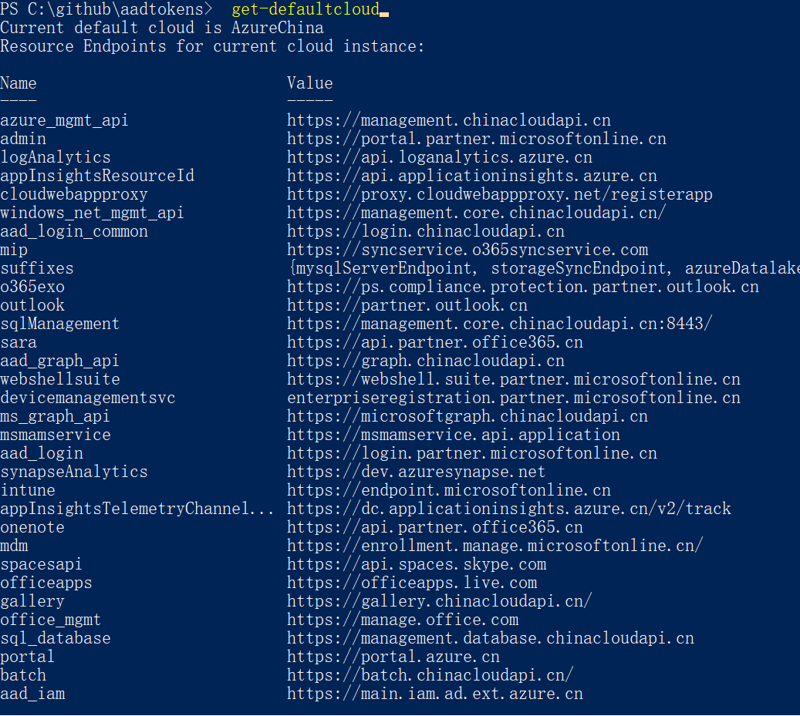
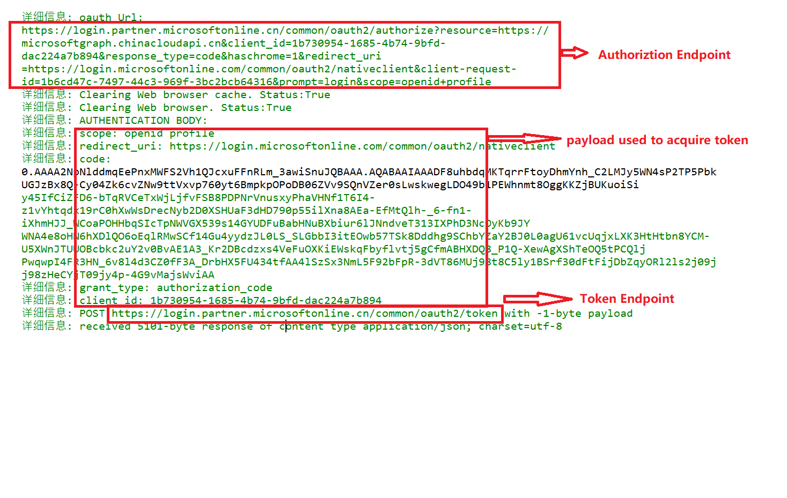
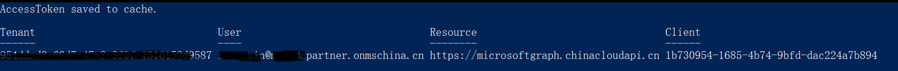

# ⚡ Azure AD oauth2 tokens and REST API calls, aka AADTokens  

Usually oauth2 token is used for secure azure resource accessing. However, it is not flexiable to test and validation oauth2 auth flow due to the reasons:

- different endpoints are used when the target cloud is not Azure Public but naitonal cloud like Azure China
- different oauth2 flow need different parameters
- different redirect_uri need to used when using first-party application to access jwt token
- Need code debuging when do simulatation and troubleshooting
- validation REST API call or MS Graph call in postman need to request/refresh access token and construct the full request url which is not easy. 

This Powershell modules is used for Azure AD oauth2 token generation which will simply the request process and address the above concerns.
By providing the 

Each command in the module support debug log output by adding "-verbose" in the command. 
 
# Get starting
## download and import the module
you may download the module to local.
sample command to download the powershshell module:

	git clone https://github.com/simonxin/aadtokens.git

To run the module in powershell session:

	import-module ./aadtokens.psm1 -force

To install the module in powershell (need to run in administrator):

	./installaadtokens.ps1
	# you can then import module directly in powershell
	import-module aadtokens

You can get all supported commands by running command: 
	$(get-module aadtokens).ExportedCommands

## Set the default cloud

You may check the current cloud instance by command:
	
	get-defaultcloud 

You will see cloud instance and the common resource endpoint:

If the current required cloud is not the expected one, you can set default cloud by command:

	# current supported cloud instance: AzureChina, AuzrePublic
	set-defaultcloud "<CloudInstance>"

## Run command to get access token

	# sample code to get access token for MSGraph
	$accesstoken = Get-AccessTokenForMSGraph

	# use token to connect to msgraph API in 21v Cloud
	Connect-MgGraph -AccessToken $accesstoken -Environment China
	Get-Mguser

	# disconnect connection to msgraph API
	Disconnect-MgGraph

# Details to request token with different oauth2 flows

### [OpenId Connect Flow](./doc/openid.md)

### [authorization code flow](./doc/authcode.md)

### [device code flow](./doc/devicecode.md)

### [client credential flow](./doc/clientcreds.md)

### [Resource Owner Password Credential flow](./doc/passwords.md)

### [On Behalf Of flow](./doc/obo.md)

### [implicit grant flow](./doc/openid.md)

### [refresh token](./doc/refreshtoken.md)

# Use Azure Management API

### [Azure Management API usage](./doc/azuremanagementapi.md)

# Use MS Graph API

### [MS Graph API usage](./doc/msgraphapi.md)

### [Admin/user consents for delegration permissions](./doc/userconents.md)

# Powershell Modules Cmdlets reference
	
### [full commands references](./doc/commands.csv)

# Advanced command parameters 

## verbose

use verbose switch in command when you want to see the detailed process for oauth2 flows
	
	$accesstoken = Get-AccessTokenForMSGraph -verbose

Sample logs:

## savetocache

1.Script is supported to save token in cache.

	# get token and save to cache
	Get-AccessTokenForMSGraph -savetocache -verbose

Output as below:

2.You will get the stored token list from cache. 

Be default, savetocache flag will request refresh token which can be used to renew access token if it is expired

	# get token list from cache
	Get-cache

Output as below:

3.Get access token from cache 

	# get specific access token from cache with clientID and resource 
	# this command will request new access token using refresh token if the access token is expired
	$accesstoken = get-accesstokenfromcache -clientId 1b730954-1685-4b74-9bfd-dac224a7b894 -resource https://microsoftgraph.chinacloudapi.cn

4.Clear cache

	# token is stored in powershell session. Close powershell session will drop the token
	# Or run below command to remove all current token
	clear-cache 

## usedevicecode

Use this swich in command to use device code flow to get access token. 

	# device code flow
	$accesstoken = Get-AccessTokenForMSGraph -savetocache -usedevicecode -verbose 

## Credentials

Use this parameter if you want to use client credential grant flow or resource Owner password credential flow to get access token.
Use client credentials will need to add -tenant and -redirectUri in command.
Sample: 

	# client creds grant flow 
	# Define tanant for single tenant client
	$tenant = "<your_tenantId>"
	
	# create ps creds based on client ID and client Secret
	$clientID = "<your_clientId>" 
	$clientSecret = "<client_secrets>"
	$SecurePassword=convertto-securestring -AsPlainText -Force -String $clientSecret
	$credential = New-Object System.Management.Automation.PSCredential -ArgumentList ($clientID,$SecurePassword)
	
	# define redirect uri for custom application
	$redirecturi = "https://login.microsoftonline.com/common/oauth2/nativeclient"

	# get access token based on client credentials
	$accesstoken = Get-AccessTokenForMSGraph -Credentials $credential -tenant $tenant -redirecturi $redirecturi -verbose 

Use password credential will need to add -tenant in command.
Sample: 

	# client creds grant flow 
	# Define tanant for single tenant client
	$tenant = "<your_tenantId>"
	
	# Add user name and password as rquired credential for ROPC
	$username = "user@contoso.com" 
	$password = "password"
	$SecurePassword=convertto-securestring -AsPlainText -Force -String $clientSecret
	$credential = New-Object System.Management.Automation.PSCredential -ArgumentList ($clientID,$SecurePassword)
	
	# get access token based for msgraph
	$accesstoken = Get-AccesstokenforMsgraph -Credentials $credential -tenant $tenant -verbose

