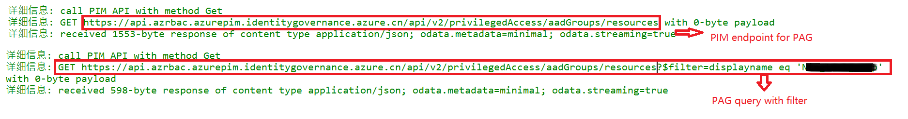
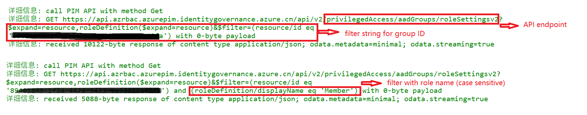
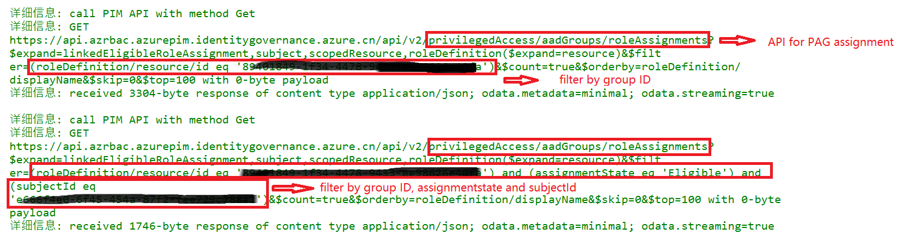
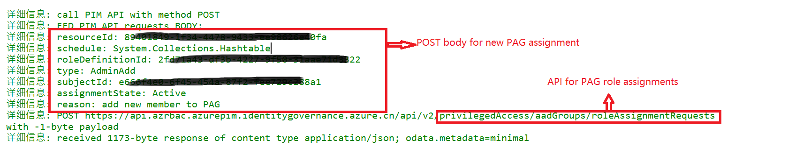
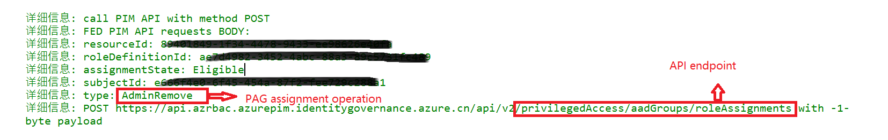
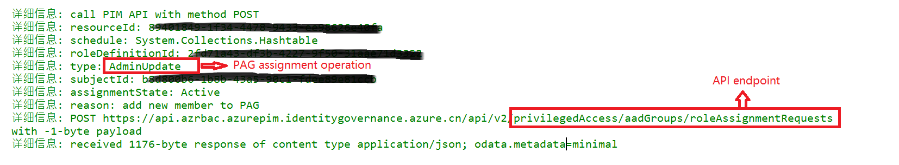
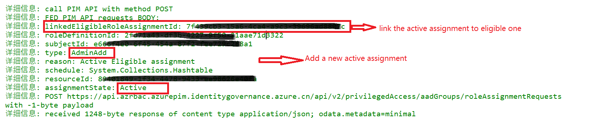

# 使用场景

PAG (privileged Access Group) 目前在MS Graph API中并不支持。 
具体可以参考以下的文档：
[PIM APIs](https://learn.microsoft.com/en-us/azure/active-directory/privileged-identity-management/pim-apis#current-iteration--azure-ad-roles-in-microsoft-graph-and-azure-resource-roles-in-azure-resource-manager)

现有的PIM Powershell 命令(例如： Get-AzureADMSPrivilegedRoleSetting -ProviderId 'aadGroups')使用了ms graph /beta/privilegedAccess API。但此项API在21v MS Graph中并不支持。
对于21v tenant, 可能的方式是使用 AzurePIM API endpoint: https://api.azrbac.azurepim.identitygovernance.azure.cn

在aadtokens中已经集成对azurepim API的使用。 以下是部分命令参考：

# 脚本使用示例一： 查询Privileged Access Groups

	# list all PAGs
	$groups = get-PIMGroups -verbose
	# filter by group name
    get-PIMGroups -groupname mygroup -verbose
	# filter by group ID
	get-PIMGroups -groupid "xxxxxxxx-xxxx-xxxx-xxxx-xxxxxxxxxxxx" -verbose

# 脚本使用示例二： 查询PAG role settings

	# get role definitions with a giving group
	$groupId = "xxxxxxxx-xxxx-xxxx-xxxx-xxxxxxxxxxxx"
	$roles = get-PIMGrouprolesettings -groupid $groupId -verbose

	# get role definitions with a giving group name
	$groupname = "mypaggroup"
	$roles = get-PIMGrouprolesettings -groupname $groupname -verbose

	# get role definitions with a giving group name and role member name
	$roles = get-PIMGrouprolesettings -groupname $groupname -rolename 'Member' -verbose

	

	

# 脚本使用示例三： 查询PAG assignment

	
	# get assignments
	$groupId = "xxxxxxxx-xxxx-xxxx-xxxx-xxxxxxxxxxxx"
	$assignments = get-PIMGroupassignments -groupID $groupID -verbose

	# get assignments with filter on assignmentstate (Eligible or Active) and subjectId
	$subjectId = "xxxxxxxx-xxxx-xxxx-xxxx-xxxxxxxxxxxx"
	$assignmentsforuser = get-PIMGroupassignments -groupID $groupID -assignmentstate 'Eligible' -subjectId $subjectId -verbose

# 脚本使用示例四： 添加PAG assignment

	# get role definition ID
	$groupId = "xxxxxxxx-xxxx-xxxx-xxxx-xxxxxxxxxxxx"
	$memberrole = get-PIMGrouprolesettings -groupname $groupname -rolename 'Member' -verbose
	$roleDefinitionId = $memberrole.id
	
	# get user object ID
	$user = get-msgraphuser -name "simonxin@mcpod.partern.onmschina.cn"	
	$subjectId = $user.id

	# add assignments (default will be Eligible assignment, but can use -assignmentstate to define assignmentstate)
	Add-PIMGroupassignments -groupid $groupId -roleDefinitionId $roleDefinitionId -subjectId $subjectID -verbose

# 脚本使用示例五： 删除PAG assignment

	Remove-PIMGroupassignments -groupid $groupId -roleDefinitionId $roleDefinitionId -subjectId $subjectID -verbose

# 脚本使用示例六： 更改PAG assignment

	# In case, if it is activated window for a eligible assignment, will cancel the current activation window and add a new one with new time range
	# Or it will update the active assignment and set the new duraion
	Update-PIMGroupassignments -groupid $groupId -roleDefinitionId $roleDefinitionId -subjectId $subjectID -assignmentstate 'Active' -duration 60 -durationunit M -verbose

# 脚本使用示例七： Activate Eligible assignment

	# active an Eligible assignment
	Activate-PIMGroupassignments -groupid $groupId -roleDefinitionId $roleDefinitionId -subjectId $subjectID -verbose

