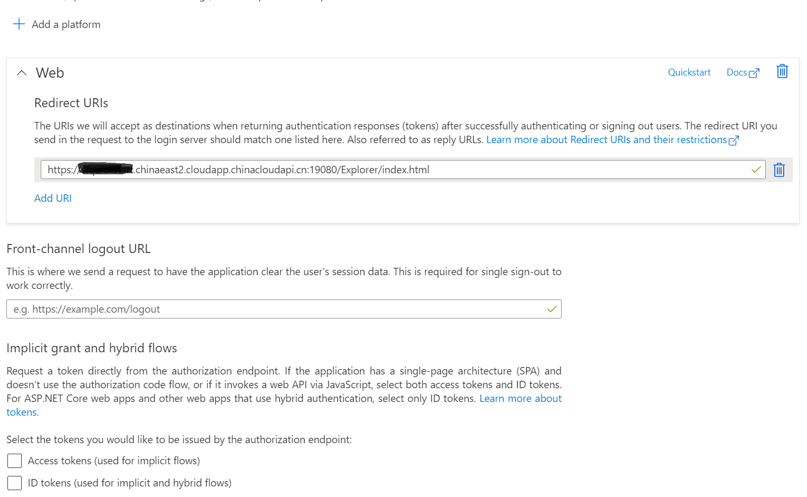
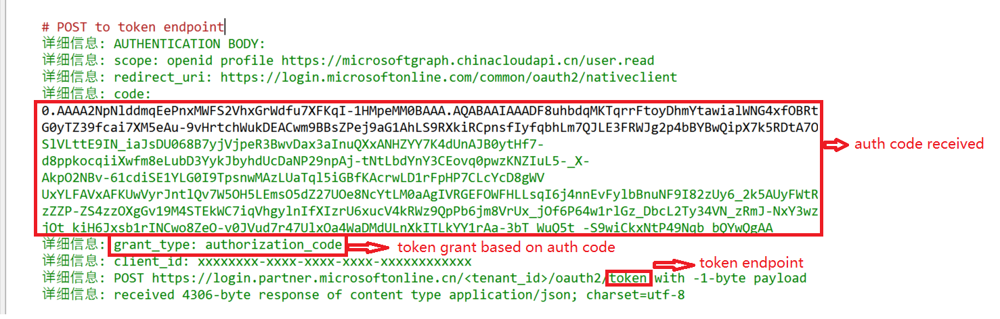

# 使用场景

Auth code使用与代码交换的证明密钥 (PKCE) 和 OpenID Connect (OIDC) 配对的身份验证代码流来获取access token.

Auth code 基本流程： 

# 配置要求

auth code的使用需要在对应AAD中注册application,添加single-page application,web或Mobile and desktop applications平台.
根据平台要求设置Redirect Uri 

示例：

# 脚本使用示例一： 使用auth code申请access token 

执行以下命令可以使用auth code方式申请access code:

	$clientId = "<custom_app_clientId>"
	$tenant = "<your_tenantId>"
	$Resource = "https://microsoftgraph.chinacloudapi.cn"
	$RedirectUri = "https://login.microsoftonline.com/common/oauth2/nativeclient"

	$accesstoken = Get-AccessToken  -Resource $Resource -ClientId $clientId  -Tenant $Tenant -redirecturi $RedirectUri -verbose

输出的申请链接示例：

	

