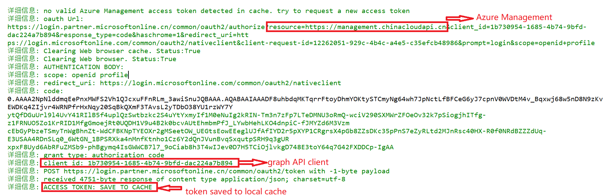
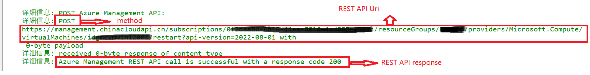
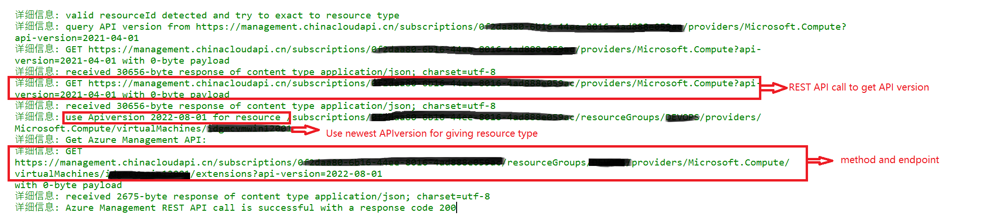
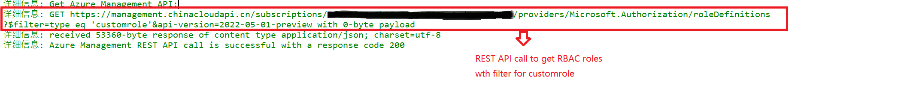
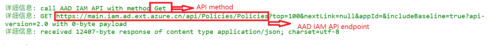
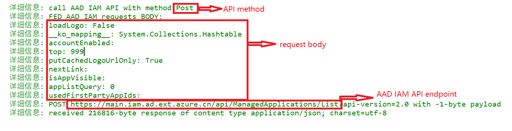

# 使用场景

Azure Management API指使用Azure REST API来访问管理Azure资源。
具体可以参考以下的文档：
[Azure REST API](https://learn.microsoft.com/en-us/rest/api/azure/)

当前模块将根据缺省cloud使用对应REST API发起API 调用。
例如：缺省cloud是AzureChina, 使用以下的REST API endpoints:
Azure REST API: https://management.chinacloudapi.cn
Azure AAD Rest API: https://main.iam.ad.ext.azure.cn

# 可用参数

## command (必选)

使用 -command参数指定Azure REST API的完整调用命令

## subscriptionId (必选)

使用 -subscriptionId指定对Azure REST API调用命令的subscription部分的填充. 不能和-command参数一起使用。

## resourcetype (必选)

使用 -resourcetype指定对Azure REST API调用命令的provider部分的填充。不能和-command参数一起使用。

## resourcegroup (可选)

使用 -resourcegroup指定对Azure REST API调用命令的resourcegroup部分的填充。不能和-command参数一起使用。

## resourcename (可选)

使用 -resourcename指定对Azure REST API调用命令的resource instance部分的填充。不能和-command参数一起使用。

## accesstoken (可选)

使用 -accesstoken使用特定的token来访问REST API。 不指定accesstoken参数的话，会尝试引用powershell session cache中保存的token。 如果local cache没有保存token, 会通过AAD账号验证申请新的access token

## method (可选)
使用 -method指定对REST API的调用方式。 不指定会使用GET作为缺省调用方式。
method支持的值为Put,Get,Post,Delete

## body (可选)
使用 -body指定对REST API的调用方式时的负载。 body格式：
	$body=@{
		"p1"="v1"
		"p2"="v2"
		"p3"=@{
			"p31"="v31"
		}
	}

## verbose (可选)

使用 -verbose参数输出REST API call的具体过程

# 脚本使用示例一: 使用command调用Azure Management API 
	
	# Restart VM using REST API: 
	# https://learn.microsoft.com/en-us/rest/api/compute/virtual-machines/restart?tabs=HTTP
	$command = "/subscriptions/{subscriptionId}/resourceGroups/{resourceGroupName}/providers/Microsoft.Compute/virtualMachines/{vmName}/restart?api-version=2022-08-01"
	$method = "POST"
	$result = call-AzureManagementAPI -command $command -method $method -verbose

输出内容中可以看到access token申请和Azure REST API调用 

# 脚本使用示例二: 使用resourceID调用Azure Management API 
	

	# List installed extensions for VM: 
	# https://learn.microsoft.com/en-us/rest/api/compute/virtual-machine-extensions/list?tabs=HTTP
	$resourceId = "/subscriptions/{subscriptionId}/resourceGroups/{resourceGroupName}/providers/Microsoft.Compute/virtualMachines/{vmName}"
	$operation = "restart"
	$method = "POST"
	$result = call-AzureManagementAPI -resourceId $resourceId -operation $operation -method $method -verbose

输出内容中可以看到APIversion的查询和Azure REST API调用 
	

# 脚本使用示例三: 使用Azure Management API执行常用命令
	
	# get custom rbac roles
	$subscriptionId = "<your_sub_ID>"
	$filter = "type eq 'customrole'" 
	$rbacroles = Get-AzureRBACroles -subscriptionId $subscriptionId -filter $filter -verbose

输出内容中可以看到rbac role所使用的REST API call。
	

# 脚本使用示例四:  使用command调用AAD IAM API	

	# get conditional policy in tenant
	$command = "Policies/Policies?top=100&nextLink=null&appId=&includeBaseline=true"
	$capolicies = Call-AzureAADIAMAPI -Command $command -verbose

输出内容:	

# 脚本使用示例五: 使用AAD IAM API执行常用命令
	

	# get applications in tenant
	$applications = Get-TenantApplications -verbose

输出内容:
	
