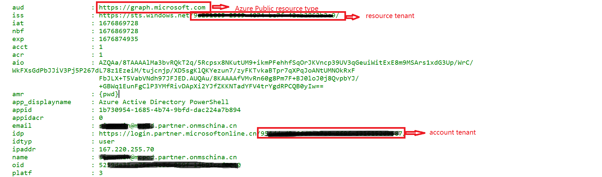

# 使用场景

脚本支持Cross Cloud B2B 调用。
在使用脚本之前， 请按照以下文档设置Cross Cloud B2B:
<https://learn.microsoft.com/en-us/azure/active-directory/external-identities/cross-cloud-settings>

ccb2b 使用示例：

# 在执行脚本的时候， 如果是ccb2b调用， 需要用 -tenant参数指定resource tenant. 

	call-msgraphapi -tenant <resource_tenant> -verbose
	
# cc b2b保留的account cache

