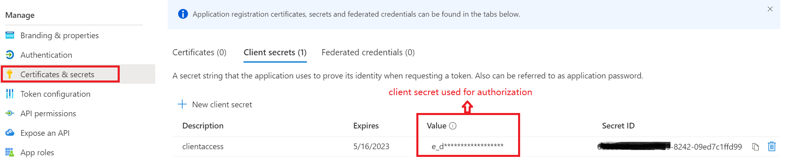
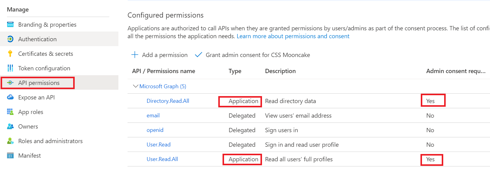
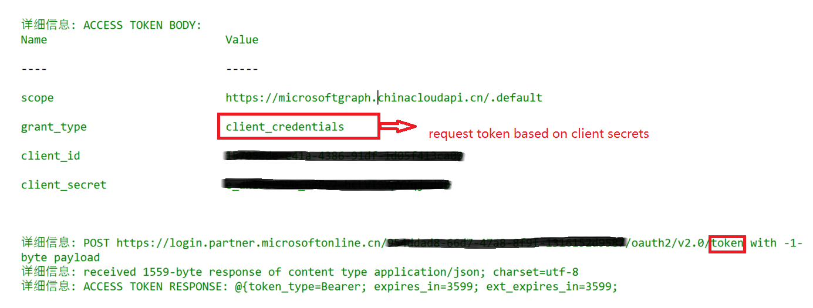

# 使用场景

client credential flow 允许用户使用注册的web application机密进行身份验证。并可以在完成授权后分配包含application type permission 的access token。

client credentials flow 基本流程： 

# 配置要求

client credentials flow需要在对应AAD中注册application. 并为application生成用于身份认证的机密。
示例：

由于使用的是应用程序自己的凭据，因此必须确保这些凭据的安全，即永远不要在源代码中发布该凭据，不要将其嵌入到网页中，也不要在广泛分布的本机应用程序中使用它。

同时，需要为application分配类型为application的API permission。 这些application permission都需要tenant Admin授权。 

# 脚本使用示例一： 使用client credential申请access token 

	# client creds grant flow 
	# Define tanant for single tenant client
	$tenant = "<your_tenantId>"
	
	# create ps creds based on client ID and client Secret
	$clientID = "<your_clientId>" 
	$clientSecret = "<client_secrets>"
	$SecurePassword=convertto-securestring -AsPlainText -Force -String $clientSecret
	$credential = New-Object System.Management.Automation.PSCredential -ArgumentList ($clientID,$SecurePassword)
	
	# define redirect uri for custom application
	$redirecturi = "https://login.microsoftonline.com/common/oauth2/nativeclient"

	# get access token based on client credentials
	$accesstoken = Get-AccessTokenForMSGraph -Credentials $credential -tenant $tenant -redirecturi $redirecturi -verbose 

Client Credentials flow并不需要authorize endpoint完成身份验证。 可以直接使用token endpoint申请access token。

