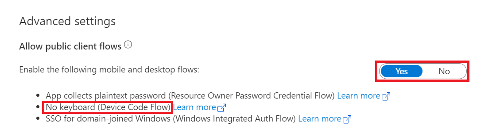

# 使用场景

Device code flow 允许用户在另一台设备上的浏览器中访问一个网页，以进行登录。 用户登录后，设备可以获取所需的Access Token.

device code 基本流程： 

# 配置要求

Device code flow需要在对应AAD中注册application. 并为application启用public client flow.
示例：

# 脚本使用示例一： 使用-usedevicecode switch申请access token 

	# client creds grant flow flow
	# Define tanant for single tenant client
	$tenant = "954ddad8-66d7-47a8-8f9f-1316152d9587"
	
	# create ps creds based on client ID and client Secret
	$clientID = "15705ede-e41a-4386-91df-1d05f413ca09" # app registration clientId
	$clientSecret = "e_dkl9zP5Vm_6ePv2~bcLVI9XpYYqj.d60"
	$SecurePassword=convertto-securestring -AsPlainText -Force -String $clientSecret
	$credential = New-Object System.Management.Automation.PSCredential -ArgumentList ($clientID,$SecurePassword)
	
	# define redirect uri for custom application
	$redirecturi = "https://login.microsoftonline.com/common/oauth2/nativeclient"

	# get access token based on client credentials
	$accesstoken = Get-AccessTokenForMSGraph -Credentials $credential -tenant $tenant -redirecturi $redirecturi -verbose 

