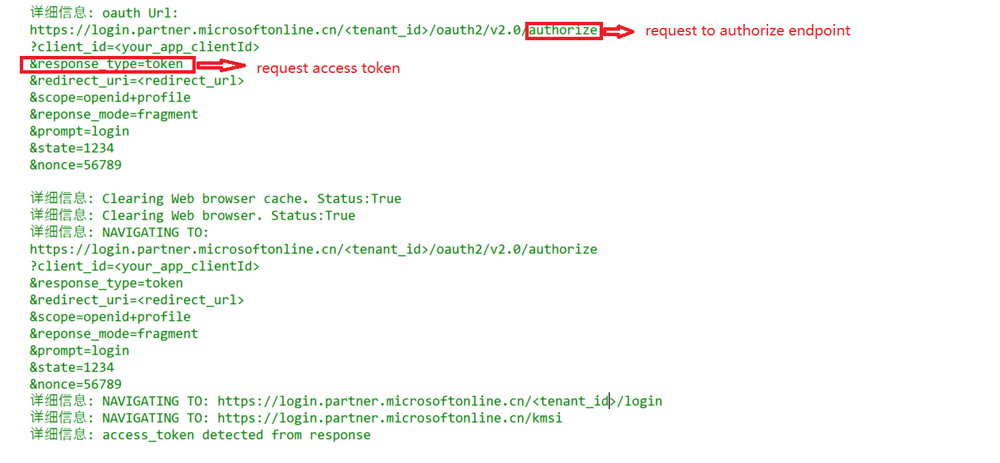

# 使用场景

implicit grant flow适用于以下场景：
Access Token直接从 /authorize 终结点返回，而不是从 /token 终结点返回.

implicit grant flow基本流程： 

# 配置要求

implicit grant flow的配置要求和OIDC connection类似。 需要在对应AAD中注册application,添加single-page application或web平台。
开启"隐式授权和混合流"(支持single-page application或web)，并启用Id Token和Access Token.
示例：

# 脚本使用示例:

implicit grant flow和OpenID Connect类似。 如果需要直接获取access token, 可以设置tokentype = token (缺省是申请Id Token)：

	$clientId="<your_app_clientId>"	
	$redirectUri="<your_app_redirectUri>"	
	$tenantId="<your_AAD_tenantID>"
	$tokentype = "token"  # support token, id_token, id_token+token
	$accesstoken = get-idtoken -clientId $clientId -redirectUri $redirectUri -tenant $tenantId -tokentype $tokentype -verbose	
	$accesstoken

access token从authorize endpoint直接返回。并不需要token endpoint: 

如果Application 并不支持所申请的token类型，访问会报错：

