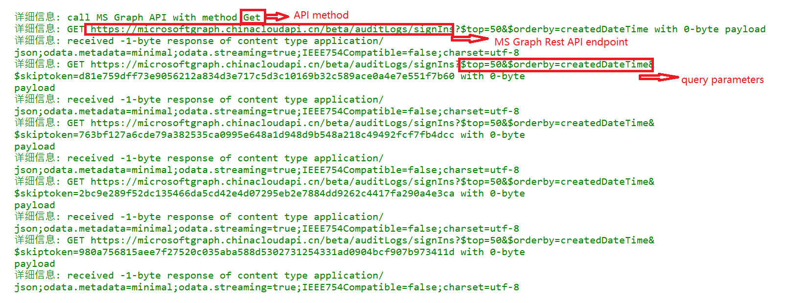
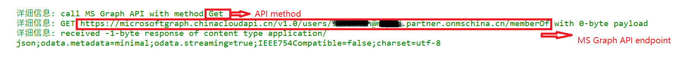
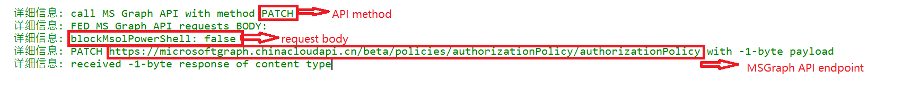

# 使用场景

MS Graph API 可以参考以下的文档：

[Ms Graph beta](https://learn.microsoft.com/en-us/graph/api/overview?view=graph-rest-beta&preserve-view=true)

[Ms Graph v1.0](https://learn.microsoft.com/en-us/graph/api/overview?view=graph-rest-1.0&preserve-view=true)

当前模块将根据缺省cloud使用对应MS Graph API endpoint发起API调用。

# 可用参数

## API (必选)

使用 -API参数指定MS Graph API的调用路径。例如: [auditLogs/signIns](https://learn.microsoft.com/en-us/graph/api/signin-list?view=graph-rest-1.0&tabs=http#http-request)

## QueryString (可选)

使用 -QueryString指定对MS Graph API调用所用的查询参数。 例如: [$top=1](https://learn.microsoft.com/en-us/graph/api/directoryaudit-list?view=graph-rest-1.0&tabs=http#optional-query-parameters)
缺省为空值。

## ApiVersion (可选)

使用 -ApiVersion指定对MS Graph API调用所用API版本。 可以使用的参数值为: beta, v1.0
缺省为beta

## method (可选)
使用 -method指定对REST API的调用方式。 不指定会使用GET作为缺省调用方式。
method支持的值为Put,Get,Post,Delete,Patch,Update
缺省为GET

## body (可选)
使用 -body指定对REST API的调用方式时的负载。 body格式：
	$body=@{
		"p1"="v1"
		"p2"="v2"
		"p3"=@{
			"p31"="v31"
		}
	}
缺省为空值。

## accesstoken (可选)

使用 -accesstoken使用特定的token来访问REST API。 不指定accesstoken参数的话，会尝试引用powershell session cache中保存的token。 如果local cache没有保存token, 会通过AAD账号验证申请新的access token

## verbose (可选)

使用 -verbose参数输出REST API call的具体过程

## MaxResults (可选)

使用 -MaxResults来限制返回数据条数。
缺省为200

# 脚本使用示例一: 使用API和querystring调用MS graph [auditlogs](https://learn.microsoft.com/en-us/graph/api/signin-list?view=graph-rest-beta&tabs=http)
	
	$API="auditLogs/signIns"
	$queryString = "`$top=50&`$orderby=createdDateTime"
    $results=Call-MSGraphAPI -API $API -QueryString $queryString -verbsoe

输出内容中可以看到MS Graph API调用:
	

# 脚本使用示例二: 使用MS Graph常用调用
	

	# Get user membership
	Get-MSGraphUserMemberOf -UserPrincipalName <user>@<domain> -verbose 
	 
输出内容:
	

	# Get user membership
	Enable-TenantMsolAccess -verbose

输出内容:

