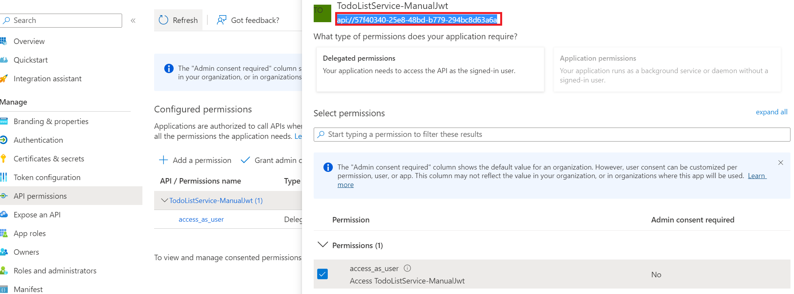
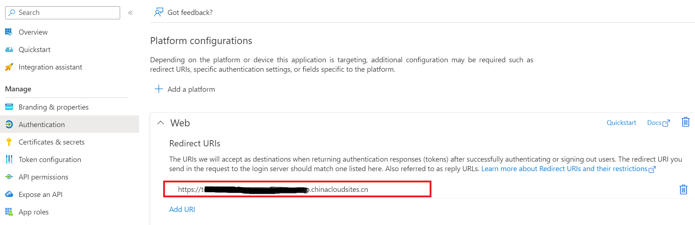
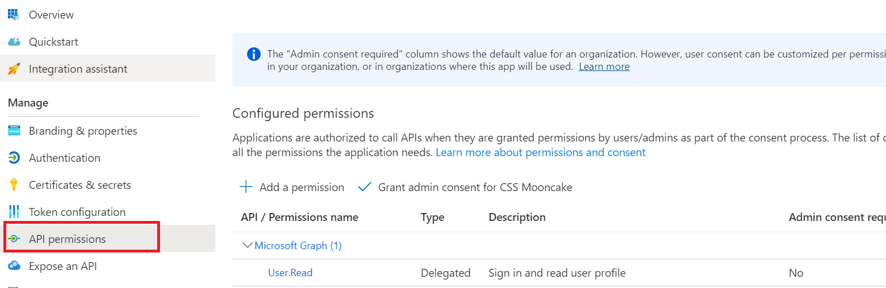
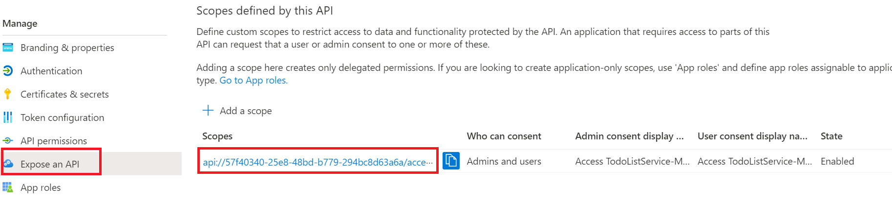
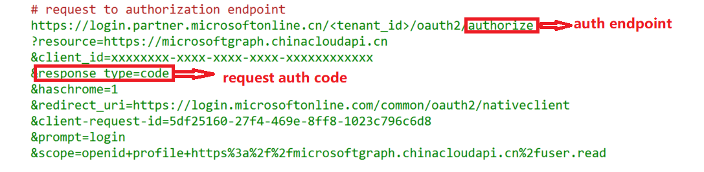
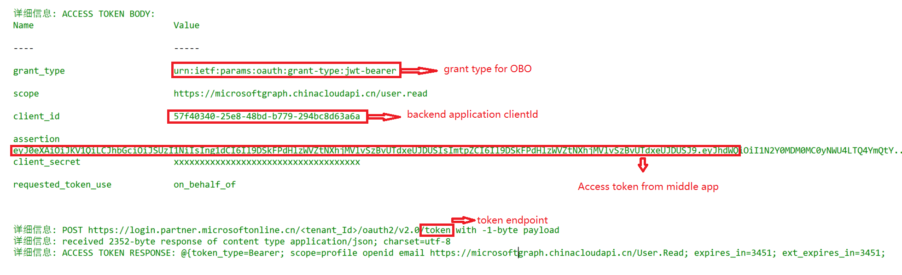

# 使用场景

on behalf of flow (OBO)适用于以下场景：
应用程序调用服务/Web API，而后者又需要调用另一个服务/Web API。 通过请求链传播委托用户标识和权限。 要使中间层服务向下游服务发出身份验证请求，该服务需要代表用户保护 Microsoft 标识平台提供的访问令牌。

OBO flow 基本流程： 

# 配置要求

OBO flow需要配置中间层Web application和后端Web Application。

## 中间层Web Application

分配后端web service的API权限(API://<backend_app_id>)

## 后端Web Application

需要为web application生成用于身份认证的机密

需要为web application设置redirect_uri以便正常跳转。

需要为web application设置所需的delegration permission。 例如：

需要为web application设置custom API permission：

# 脚本使用示例一： 模拟OBO flow申请access token 

web client适用auth code flow的方式申请中间层web application的access token。 设置scope为后端Web application custom API permission: 
	$midclientId = "<middle_application_id>"
	$Tenant = <your_tenant>
	$resource = "57f40340-25e8-48bd-b779-294bc8d63a6a"
	$Scope = "api://57f40340-25e8-48bd-b779-294bc8d63a6a/access_as_user"
	$RedirectUri = "https://login.microsoftonline.com/common/oauth2/nativeclient"
	
	$clienttoken =  Get-AccessToken -Resource $Resource -ClientId $midclientId  -Tenant $Tenant -redirecturi $RedirectUri -verbose

模拟输出：

中间层application 使用client secret申请OBO flow access token。

	$webapisec = "<moddile_application_secret>"
	
	$SecurePassword=convertto-securestring -AsPlainText -Force -String $webapisec
	$credential = New-Object System.Management.Automation.PSCredential -ArgumentList ($resource,$SecurePassword)
	
	$Scope = "https://microsoftgraph.chinacloudapi.cn/user.read"
	
	$accesstoken = Get-AccessTokenwithobo  -Credentials $credential -token $clienttoken -Tenant $Tenant -scope $scope -verbose
	$accesstoken.access_token
	
OBO flow并不需要再次做身份验证。 可以直接使用token endpoint申请access token。

