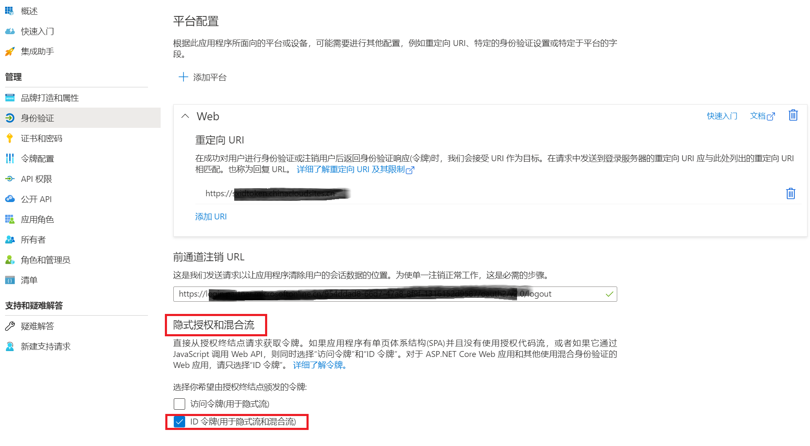
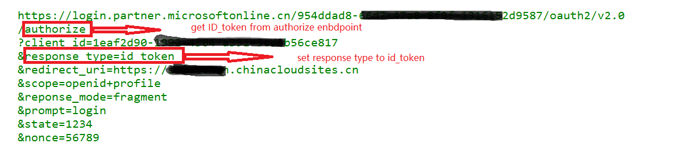
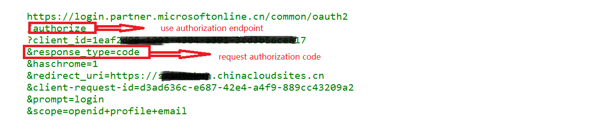

# 使用场景

OpenID Connect使用用户身份认证信息以id token的方式给到三房应用。
三方应用在验证完id token的正确性后，可以进一步通过oAuth2授权流程获得的access token读取更多的用户信息。

OpenID Connect (OIDC)基本流程： 

# 配置要求

OIDC connection的使用需要在对应AAD中注册application,添加single-page application或web平台，并开启"隐式授权和混合流"(支持single-page application或web)，并启用Id Token.
示例：

# 脚本使用示例一： 申请Id token 

执行以下命令可以发起OpenID Connect登录并得到id_token (使用 -verbose参数可以看到详细的申请参数和申请端点):

	$clientId="<your_app_clientId>"	
	$redirectUri="<your_app_redirectUri>"	
	$tenantId="<your_AAD_tenantID>"	
	$idtoken = get-idtoken -clientId $clientId -redirectUri $redirectUri -tenant $tenantId -verbose	
	$idtoken

输出的申请链接示例：

# 脚本使用示例二： 使用UserInfo API端点得到登录用户信息（不申请Id token）

推荐使用Id Token得到用户信息。 但如果如果不使用Id Token验证用户身份，也可以访问UserInfo API需要Access Token (申请UserInfo Access Token 不需要提供Resource). 
执行以下命令可以访问UserInfo API并得到登录用户信息。

	$clientId="<your_app_clientId>"	
	$clientSecret="<your_app_secret>"
	$redirectUri="<your_app_redirectUri>"	
	$userinfo = Get-UserInfo -ClientId $ClientId -clientSecret $clientSecret -redirecturi $RedirectUri -verbose
	$userinfo

输出的申请链接示例：

