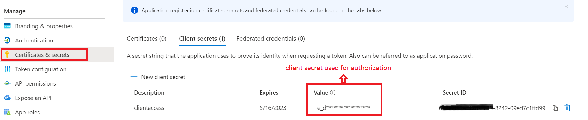
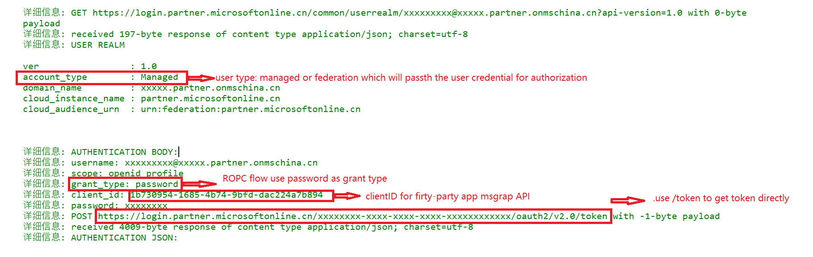

# 使用场景

Resource Owner Password Credentials (ROPC) 允许应用程序通过直接处理用户的密码来登录用户。并可以在完成授权后分配包含delegation permissions的access token。

Resource Owner Password Credentials (ROPC)  基本流程： 

# 配置要求

如果使用first-party application, 不需要额外的配置。

如果使用custom application, 需要在对应AAD中注册application, 并为application生成用于身份认证的机密。
示例：

同时， 需要确保delegation permission consents已经完成（admin consents or user consents granted)

！注意： Resource Owner Password Credentials (ROPC) 并不支持MFA账号的认证。  

# 脚本使用示例一： 使用username/pssword申请MSgraph access token 

	# Define tanant as it is required for ROPC
	$tenant = "<your_tenantId>"

	# Add user name and password as rquired credential for ROPC
	$username = "user@contoso.com" 
	$password = "password"
	$SecurePassword=convertto-securestring -AsPlainText -Force -String $clientSecret
	$credential = New-Object System.Management.Automation.PSCredential -ArgumentList ($clientID,$SecurePassword)
	
	# get access token based for msgraph
	$accesstoken = Get-AccesstokenforMsgraph -Credentials $credential -tenant $tenant -verbose

ROPC flow并不需要authorize endpoint完成身份验证。 可以直接使用token endpoint申请access token. 

# 脚本使用示例二： 使用username/pssword和client/clientsecret申请access token 

	# Passwords creds grant flow 
	# Define tanant for single tenant client
	$tenant = "<your_tenantId>"
	
	$clientID = "xxxxxxxx-xxxx-xxxx-xxxx-xxxxxxxxxxxx" # app registration clientI
	$clientSecret = "<app_secrets>"

	# Add user name and password as rquired credential for ROPC
	$username = "user@contoso.com" 
	$password = "password"
	$SecurePassword=convertto-securestring -AsPlainText -Force -String $clientSecret
	$credential = New-Object System.Management.Automation.PSCredential -ArgumentList ($clientID,$SecurePassword)
	
	# define redirect uri for custom application. Use redirecturi configured in desktop platform to get access token only
	$clientId = <your_application_clientId>
	$redirecturi = "https://login.microsoftonline.com/common/oauth2/nativeclient"
	
	# get access token based on client credentials
	$accesstoken = Get-Accesstoken -Credentials $credential -tenant $tenant -clientId $clientId -clientsecret $clientsecret -verbose

ROPC flow使用custom app时无法发出permission consent请求。 如果之前没有做过user consent, 命令将返回报错：
	

重新申请user consents后（命令参考[user consents](./doc/userconents.md)）,可以看到access token正常获取。

