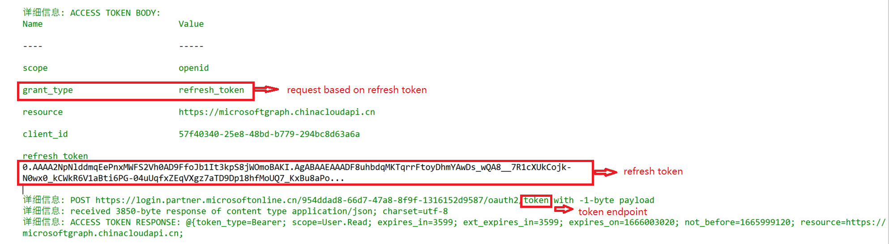
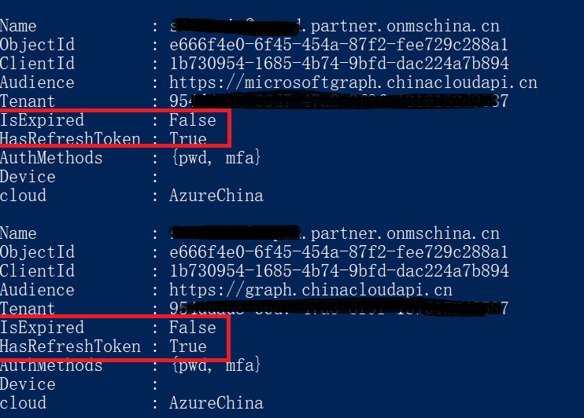

# 使用场景

refresh token 用于需要在现有access token已经失效的情况下，重新申请新的access token。
refresh token 需要在首次通过token endpoint 申请access token的时候指定要求返回refresh token。
auth code flow, device code flow和 on behalf of flow中都可以申请refresh token。

# 脚本使用示例一: local cache自动刷新access token

使用-savetocache 命令申请access token并保存到powershell session会自动申请refersh token。

	# get token and save to cache
	Get-AccessTokenForMSGraph -savetocache -verbose

	# get specific access token from cache with clientID and resource 
	# this command will request new access token using refresh token if the access token is expired
	$accesstoken = get-accesstokenfromcache -clientId 1b730954-1685-4b74-9bfd-dac224a7b894 -resource https://microsoftgraph.chinacloudapi.cn

# 脚本使用示例二: 使用-IncludeRefreshToken 参数申请refresh token。 使用refresh token刷新access token 

	
	$clientID = "<your_client_id>"
	$tenant = "<your_tenant_id>"

	$Resource = "https://microsoftgraph.chinacloudapi.cn"
	$RedirectUri = "https://login.microsoftonline.com/common/oauth2/nativeclient"
	# set IncludeRefreshToken = true in command
	$tokens = Get-AccessToken  -Resource $Resource -ClientId $clientId -RedirectUri $RedirectUri -IncludeRefreshToken $true -verbose

返回的tokens包含了2个token。 tokens[0] = Access_token, tokens[1] = refresh_token。 使用refersg token 刷新access token并不需要重新做身份认证。 

	# use command Get-AccessTokenWithRefreshToken to request new access token
	$newtokens = Get-AccessTokenWithRefreshToken -TenantId $Tenant  -clientId $clientID -resource $resource -RefreshToken $tokens[1] -IncludeRefreshToken $true -verbose

输出内容中可以看到refresh token直接通过token endpoint得到了新的access token: 

# 脚本使用示例三: 查看local cache并取得refresh token

使用-refreshtoken 参数取得保存的refersh token。

	# get cached token information
	Get-cache

	# get specific refresh token from cache with clientID and resource 
	$Refereshtoken = Get-RefreshTokenFromCache -clientId <clientId>
	$Refereshtoken
