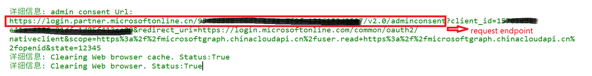
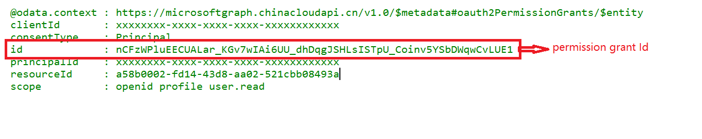

# 使用场景

Application访问Azure资源需要分配权限。 如果是代理用户的方式访问，需要分配delegation permissions。

delegation permission 需要完成授权。授权方式为Admin consents和user consents. 具体内容可以参考：
<https://learn.microsoft.com/en-us/azure/active-directory/manage-apps/user-admin-consent-overview>

如果没有完成过授权，访问application将有以下的consent 页面要求授权：

1) 用户有权限进行授权（用户有 DelegatedPermissionGrant.ReadWrite.All 权限）

2) 用户没有有权限进行授权 （允许用户申请consents)

同时，部分oauth2 auth flow，例如resource owner password credential flow无法发起授权页面, 会导致web application访问失败。 

对此场景，可以使用admon consent/user consent完成授权。 

以下是部分命令：

# 脚本使用示例一： 对指定application发起admin consent请求
使用AAD adminconsent endpoint直接申请admin consent 授权：
<https://learn.microsoft.com/en-us/azure/active-directory/develop/v2-admin-consent>
	
    $clintId = "15705ede-e41a-4386-91df-1d05f413ca09"
	$tenant = "954ddad8-66d7-47a8-8f9f-1316152d9587"
	$redurectUri = "https://login.microsoftonline.com/common/oauth2/nativeclient"
	$scope = "https://microsoftgraph.chinacloudapi.cn/user.read https://microsoftgraph.chinacloudapi.cn/openid"

	Get-AdminConsent -clientId $clintId -tenant $tenant -RedirectUri $RedirectUri -scope $scope -verbose

admin consent授权页面:

admin consent授权完成:

# 脚本使用示例二： 对指定用户和application完成授权

用户没有有权限进行授权，可以申请consents：

批准申请，将适用admin consent，允许application可以代理所有用户。

如果需要applicaton只能对特定用户代理授权，可以使用 MS Graph API: <a href="https://learn.microsoft.com/en-us/graph/api/resources/oauth2permissiongrant?view=graph-rest-1.0" title="oauth2permissiongrant">oauth2permissiongrant</a>

	# get service principal object ID with a application ID
	$appid = "1eaf2d90-1992-4304-a391-3cd3b56ce817"
	$spid = $(get-MSGraphServicePrincipal -appid $appid).id
	
	# get service principal object ID with a target resource appId
	# we can get knownclient for msgraph which is "00000003-0000-0000-c000-000000000000"
	$msgraphappid = $(Get-AADknownclient msgraph).clientid
	$resourceid = $(get-MSGraphServicePrincipal -appid $msgraphappid).id	
	# required permissions for target resource
	$scope="openid profile user.read"

	# evalate the user consents for giving user
	$user = "simonxin_wvdtest@mcpod.partner.onmschina.cn" 
	$isconsented = test-MSGraphUserconsent -clientId $spid -UserPrincipalName $user -resourceId $resourceid -scope $scope -verbose

以上命令会检查当前的admin consents和user consents， 并根据提供的scope判断是否已经对所有权限完成授权。

如果未授权，可以使用以下命令完成user consents

	# use -force will remove the current user consents for target application and resourceId. Then create a new permission grants
	if (!$isconsented) {
		add-MSGraphUserconsent -clientId $spid -UserPrincipalName $user -resourceId $resourceid -scope $scope -force -verbose
	}

授权完成：

	

# 脚本使用示例三： 清除user consent 

	# remove granted user consents
	clear-MSGraphUserconsent -clientId $spid -UserPrincipalName $user -resourceId $resourceid -verbose

